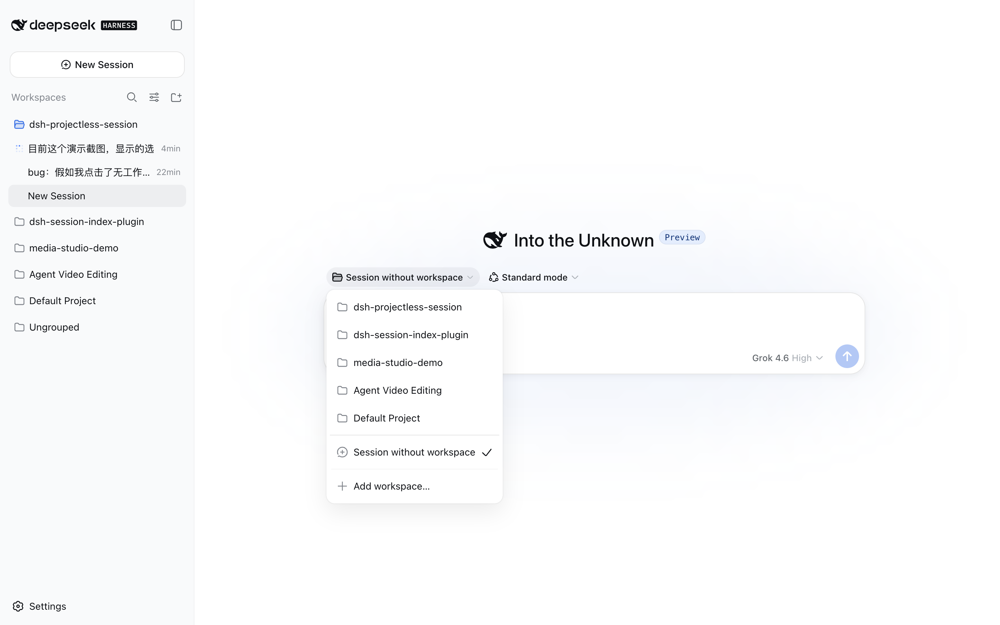
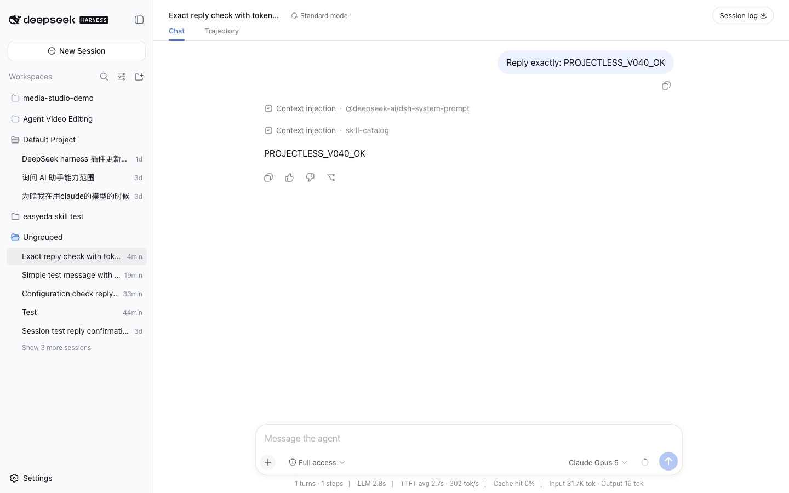

# dsh-projectless-session

[English](#english) | [简体中文](#简体中文)

## English

A DeepSeek Harness Web/Desktop plugin that adds **Session without workspace**
to the existing Workspace picker. Every session receives its own date-organized
working directory:

```text
~/Documents/DSH/YYYY-MM-DD/session-HH-mm-ss-random/
```



The plugin uses DSH's Cordis Host/Client extension APIs and does not modify
DeepSeek Harness source. Its UI follows the DSH Language setting and includes
complete English and Simplified Chinese dictionaries.

### How it works

DSH `0.1.0-rc.6` disables its native blank-session composer when a Session has
no registered Workspace. To retain the complete native composer—including
agent preset, commands and attachments, access mode, model selection, and the
send button—the plugin uses this lifecycle:

1. The Host creates a directory through a loopback-only DSH Connection RPC.
2. The client registers that directory as a temporary Workspace.
3. DSH creates and opens a Session in the temporary Workspace, so the standard
   blank-session UI remains fully available.
4. After DSH accepts the first prompt and reports `blank === false`, the plugin
   deletes only the Workspace registration.
5. DSH keeps the Session, log, `cwd`, and directory; the conversation moves to
   the built-in **Ungrouped** section and remains resumable.



Deleting the registration does not delete the working directory or Session
history. If DSH exits before the first prompt is accepted, or Workspace cleanup
fails, the temporary Workspace may remain registered; no Session data or user
files are removed.

### Compatibility

- DeepSeek Harness `0.1.0-rc.6`
- Node.js `22.19` or later
- Local Web/Desktop profile

### Install

From GitHub:

```bash
dsh plugin --profile web add github:jarvisluk/dsh-projectless-session
```

From a release tarball:

```bash
dsh plugin --profile web add /absolute/path/dsh-projectless-session-0.4.0.tgz
```

Restart a running `dsh web` process after installation. To uninstall:

```bash
dsh plugin --profile web remove dsh-projectless-session
```

### Behavior

- Preserves every existing Workspace entry and DSH's native **Add workspace…**
  action.
- Creates an isolated working directory with a collision-resistant suffix.
- Uses DSH's complete native new-session UI before the first prompt.
- Uses the current DSH default agent preset, model, and permission preset;
  native selectors can change them before sending.
- Removes only the temporary Workspace registration after the first prompt.
- Keeps the Session resumable under **Ungrouped** across DSH restarts.
- Switches plugin copy live between English and Simplified Chinese with the DSH
  Language setting.
- Accepts filesystem RPC calls only from loopback pages, preventing a LAN page
  from asking the Host to write under Documents.
- Restores DSH's built-in priority `0` Workspace picker automatically when the
  plugin is removed.

### Custom root directory

Override the plugin configuration in the Web profile's `cordis.patch.yml`:

```yaml
- id: dsh-projectless-session
  config:
    root: /absolute/path/to/DSH
```

### Development

```bash
npm ci
npm run verify
npm pack
```

Tests cover the bilingual dictionaries, directory safety constraints, local
date hierarchy, temporary Workspace lifecycle, cleanup after the first accepted
prompt, and rollback when Session creation fails.

## 简体中文

这是一个 DeepSeek Harness Web/Desktop 插件，在现有工作区选择器中加入
**无工作区会话**。每个会话都会获得一个按日期整理的独立工作目录：

```text
~/Documents/DSH/YYYY-MM-DD/session-HH-mm-ss-random/
```


插件使用 DSH 的 Cordis Host/Client 扩展接口，不修改 DeepSeek Harness
源码。界面文案跟随 DSH Language 设置，完整支持英文和简体中文。

### 工作方式

在 DSH `0.1.0-rc.6` 中，没有已注册 Workspace 的空白 Session 会禁用原生
编辑器。为了完整保留 Agent 预设、命令与附件、访问模式、模型选择和发送
按钮，插件采用以下生命周期：

1. Host 通过仅允许 loopback 调用的 DSH Connection RPC 创建目录。
2. 客户端把该目录注册为临时 Workspace。
3. DSH 在临时 Workspace 中创建并打开 Session，因此空白会话继续使用完整
   的原生界面。
4. DSH 接受首条消息并报告 `blank === false` 后，插件只删除 Workspace 注册。
5. DSH 保留 Session、日志、`cwd` 和目录；会话进入内置的**未分组**区域，
   之后仍可恢复和继续。


删除 Workspace 注册不会删除工作目录或会话历史。如果 DSH 在首条消息接受前
退出，或者注销操作失败，临时 Workspace 可能继续显示；不会因此删除 Session
数据或用户文件。

### 兼容性

- DeepSeek Harness `0.1.0-rc.6`
- Node.js `22.19` 或更高版本
- 本机 Web/Desktop profile

### 安装

从 GitHub 安装：

```bash
dsh plugin --profile web add github:jarvisluk/dsh-projectless-session
```

从 Release 压缩包安装：

```bash
dsh plugin --profile web add /absolute/path/dsh-projectless-session-0.4.0.tgz
```

安装后重启正在运行的 `dsh web`。卸载：

```bash
dsh plugin --profile web remove dsh-projectless-session
```

### 行为

- 保留已有 Workspace 和 DSH 原生的**添加工作区…**入口。
- 创建带防冲突随机后缀的独立工作目录。
- 首条消息前完整复用 DSH 原生新会话界面。
- 使用 DSH 当前默认的 Agent 预设、模型和权限；发送前可以通过原生控件修改。
- 首条消息接受后只删除临时 Workspace 注册。
- Session 进入**未分组**，重启 DSH 后仍可恢复并继续。
- 跟随 DSH Language 设置即时切换英文或简体中文。
- 文件系统 RPC 仅允许 loopback 页面调用，LAN 页面不能让 Host 写入 Documents。
- 卸载插件后，DSH 内置优先级 `0` 的 Workspace 选择器自动恢复。

### 自定义根目录

在 Web profile 的 `cordis.patch.yml` 中覆盖插件配置：

```yaml
- id: dsh-projectless-session
  config:
    root: /absolute/path/to/DSH
```

### 开发

```bash
npm ci
npm run verify
npm pack
```

测试覆盖双语词典、目录安全约束、本地日期层级、临时 Workspace 生命周期、
首条消息后的注销，以及 Session 创建失败时的回滚。

## License

[MIT](LICENSE)
