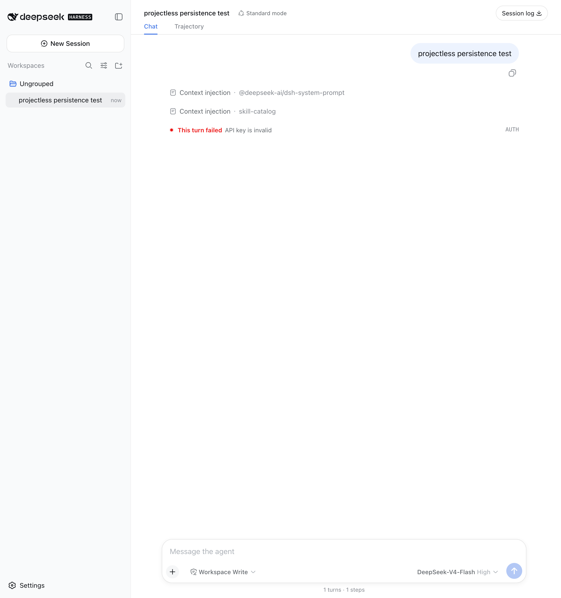

# dsh-projectless-session

为 DeepSeek Harness Web/Desktop 添加“无工作区会话”。每次创建独立工作目录：

```text
~/Documents/DSH/YYYY-MM-DD/session-HH-mm-ss-random/
```


插件使用 DSH 的 Cordis Host/Client 扩展接口，不修改 DeepSeek Harness 源码。

## 工作方式

1. Host 通过仅限 loopback 的 DSH Connection RPC 创建目录。
2. 浏览器临时把目录注册为 Workspace，创建拥有正确 `cwd` 的 Session。
3. DSH 接受第一条消息后，插件只删除 Workspace 注册。
4. Session、日志、`cwd` 和目录继续保留，并显示在“未分组”中。



空白 Session 在第一条消息前短暂显示为普通 Workspace，这是因为 DSH 会锁定未归属
Workspace 的空白 Session 输入框。第一条消息被接受后会自动转入“未分组”。

## 兼容性

- DeepSeek Harness `0.1.0-rc.6`
- Node.js `22.19` 或更高版本
- 本机 Web/Desktop profile

## 安装

### 从 GitHub 安装

仓库上传后运行：

```bash
dsh plugin --profile web add github:jarvisluk/dsh-projectless-session
```

也可以从 Releases 下载 `dsh-projectless-session-*.tgz`：

```bash
dsh plugin --profile web add /absolute/path/dsh-projectless-session-0.1.0.tgz
```

安装后重启正在运行的 `dsh web`。卸载：

```bash
dsh plugin --profile web remove dsh-projectless-session
```

## 行为

- 保留已有 Workspace 选择。
- 保留 DSH 原生“添加工作区…”入口。
- “无工作区会话”创建按日期整理、带随机后缀的独立目录。
- 第一条消息被接受后自动移除 Workspace 注册并转入“未分组”。
- 重启 DSH 后仍可从“未分组”恢复并继续会话。
- 文件系统 RPC 仅允许 loopback 页面调用，LAN 页面不能让 Host 写入 Documents。
- 卸载插件后，内置优先级 `0` 的选择器自动恢复。

## 自定义根目录

在 Web profile 的 `cordis.patch.yml` 中覆盖插件配置：

```yaml
- id: dsh-projectless-session
  config:
    root: /absolute/path/to/DSH
```

## 开发

```bash
npm ci
npm run verify
npm pack
```

测试包含目录安全约束、日期层级、空白 Session 生命周期，以及首条消息后解除
Workspace 注册的行为。真实 DSH `0.1.0-rc.6` 浏览器流程也已验证。

## English

This DeepSeek Harness Web/Desktop plugin adds a **projectless session** entry
to the existing Workspace picker. It creates date-organized directories under
`~/Documents/DSH`, retains a temporary Workspace until the first prompt is
accepted, then removes only that registration. The Session, log, cwd, and
directory remain available under DSH's built-in **Ungrouped** section.

The Host filesystem operation is exposed through a loopback-only DSH
Connection RPC. The plugin uses public Cordis services and SlotRegistry
shadowing; it does not patch DeepSeek Harness source.

## License

[MIT](LICENSE)
