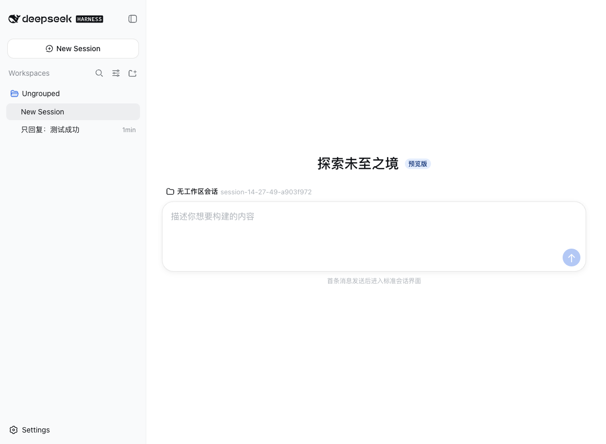

# dsh-projectless-session

为 DeepSeek Harness Web/Desktop 添加“无工作区会话”。每次创建独立工作目录：

```text
~/Documents/DSH/YYYY-MM-DD/session-HH-mm-ss-random/
```


插件使用 DSH 的 Cordis Host/Client 扩展接口，不修改 DeepSeek Harness 源码，也不会把目录注册成 Workspace。

## 工作方式

1. Host 通过仅限 loopback 的 DSH Connection RPC 创建目录。
2. 浏览器直接调用 DSH Session 运行时的 `create({ cwd, sessionId })`，创建拥有独立 `cwd` 的 Session。
3. 插件通过 `conversation.composer` takeover 插槽处理这个空白 Session 的首条消息。
4. DSH 接受第一条消息后，`blank` 状态变为 `false`，插件退出 takeover，自动回到标准会话界面。




Workspace 注册表在整个过程中保持不变；不存在“先注册、再删除”的过渡状态。Session 从创建开始就属于“未分组”，目录、日志和 `cwd` 均由 DSH 的 Session 持久化机制保存。

## 兼容性

- DeepSeek Harness `0.1.0-rc.6`
- Node.js `22.19` 或更高版本
- 本机 Web/Desktop profile

## 安装

### 从 GitHub 安装

仓库上传后运行：

```bash
dsh plugin --profile web add github:jarvisluk/dsh-projectless-session
```

也可以从 Releases 下载 `dsh-projectless-session-*.tgz`：

```bash
dsh plugin --profile web add /absolute/path/dsh-projectless-session-0.2.0.tgz
```

安装后重启正在运行的 `dsh web`。卸载：

```bash
dsh plugin --profile web remove dsh-projectless-session
```

## 行为

- 保留已有 Workspace 选择。
- 保留 DSH 原生“添加工作区…”入口。
- “无工作区会话”创建按日期整理、带随机后缀的独立目录。
- 从创建开始就是未分组 Session，不创建或删除 Workspace 注册。
- 空白阶段使用插件首条消息 Composer；消息被接受后切回 DSH 标准 Composer。
- 重启 DSH 后仍可从“未分组”恢复并继续会话。
- 文件系统 RPC 仅允许 loopback 页面调用，LAN 页面不能让 Host 写入 Documents。
- 卸载插件后，内置优先级 `0` 的选择器自动恢复。

## 自定义根目录

在 Web profile 的 `cordis.patch.yml` 中覆盖插件配置：

```yaml
- id: dsh-projectless-session
  config:
    root: /absolute/path/to/DSH
```

## 开发

```bash
npm ci
npm run verify
npm pack
```

测试包含目录安全约束、日期层级、直接 cwd Session 创建、纯 Composer 选择器，以及“零 Workspace 操作”断言。真实 DSH `0.1.0-rc.6` 浏览器流程也已验证；隔离测试 profile 的 Workspace 注册表在创建和发送消息后仍为空。

## English

This DeepSeek Harness Web/Desktop plugin adds a **projectless session** entry
to the existing Workspace picker. It creates date-organized directories under
`~/Documents/DSH` and creates the Session directly with an explicit `cwd`.
It never creates, attaches, or deletes a Workspace registration. A scoped
`conversation.composer` takeover handles the first blank prompt; after DSH
accepts it, the standard composer resumes automatically. The Session, log,
cwd, and directory remain available under DSH's built-in **Ungrouped** section.

The Host filesystem operation is exposed through a loopback-only DSH
Connection RPC. The plugin uses the DSH Session runtime and SlotRegistry
composition; it does not patch DeepSeek Harness source.

## License

[MIT](LICENSE)
